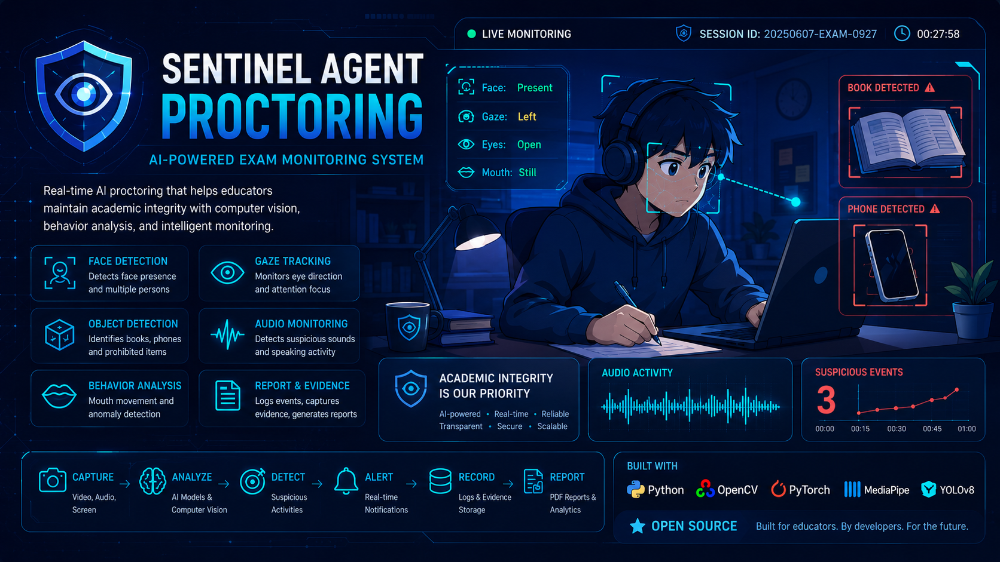
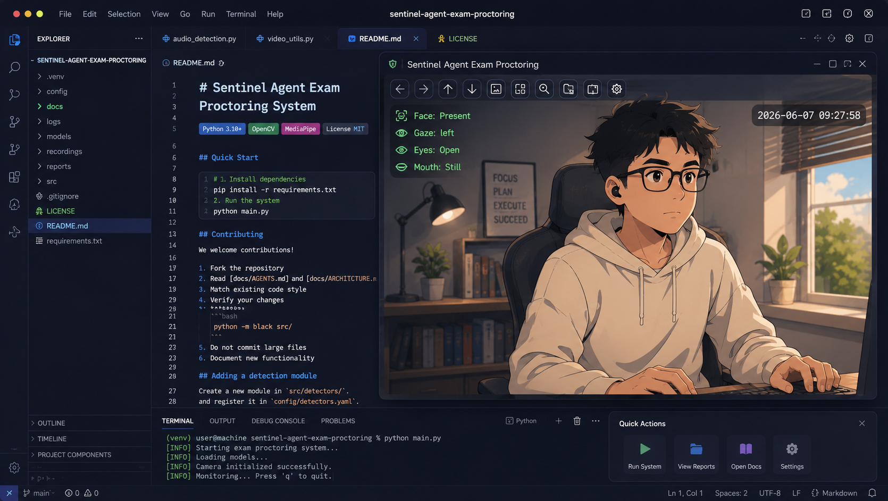
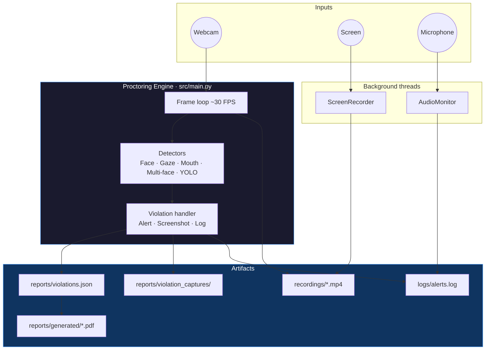

<p align="center">
  
</p>

<h1 align="center">Sentinel Agent Proctoring</h1>

<p align="center">
  Open-source <strong>exam proctoring</strong> and <strong>online exam cheating detection</strong><br/>
  powered by computer vision, object detection, and audio monitoring.
</p>

<p align="center">
  <a href="https://www.python.org/downloads/"></a>
  <a href="https://pytorch.org/"></a>
  <a href="https://opencv.org/"></a>
  <a href="https://github.com/ultralytics/ultralytics"></a>
  <a href="#license"></a>
</p>

Monitor remote exam sessions in real time. Sentinel Agent Proctoring analyzes webcam video, screen activity, and microphone input to detect behaviors associated with academic integrity violations — then logs evidence, plays voice alerts, and generates PDF reports.

**Keywords:** exam proctoring · cheating detection · online exam monitoring · face detection · gaze tracking · YOLO object detection · academic integrity · computer vision

---

## Contents

- [Preview](#preview)
- [Why Sentinel](#why-sentinel)
- [Features](#features)
- [How It Works](#how-it-works)
- [Quick Start](#quick-start)
- [Configuration](#configuration)
- [Project Layout](#project-layout)
- [Documentation](#documentation)
- [Roadmap](#roadmap)
- [Contributing](#contributing)
- [License](#license)

---

## Preview

<p align="center">
  
</p>

The OpenCV preview window overlays real-time detection status — **Face**, **Gaze**, **Eyes**, and **Mouth** — while the engine logs violations and records the session in the background.

---

## Why Sentinel

Remote and hybrid exams make it hard for educators to verify that students are working independently. Manual proctoring does not scale.

Sentinel Agent Proctoring is a **local desktop agent** that automates continuous monitoring during an exam session. It is designed for:

- **Educators** running online or hybrid assessments
- **Engineers** integrating proctoring into an LMS or assessment platform
- **Researchers** experimenting with computer-vision-based academic integrity tools

When suspicious behavior is detected, the system captures timestamped screenshots, writes structured violation logs, optionally records webcam and screen video, and produces a post-session PDF report for review.

---

## Features

**Vision & behavior detection**

- Face presence monitoring (MTCNN)
- Gaze direction and eye-openness tracking (MediaPipe Face Mesh)
- Mouth movement detection for possible talking
- Multi-face detection for unauthorized persons in frame
- Forbidden object detection — books and cell phones (YOLOv8)

**Audio & alerts**

- Background voice-activity monitoring (PyAudio + energy/ZCR heuristics)
- Optional Whisper transcription for keyword-based speech violations
- Vietnamese text-to-speech alerts via gTTS

**Evidence & reporting**

- Annotated webcam recording and optional screen capture
- Per-violation JPEG screenshots with metadata
- JSON violation log and PDF report with timeline charts and heatmaps
- Live OpenCV preview window during the session

**Monitoring dashboard** _(in progress)_ — Flask API for alert polling; UI template not yet included.

---

## How It Works



Press **`q`** in the preview window to end a session. On shutdown, recordings are finalized and a PDF report is generated automatically.

→ Deep dive: [Architecture Guide](docs/ARCHITECTURE.md)

---

## Quick Start

### Prerequisites

| Requirement                             | Notes                                         |
| --------------------------------------- | --------------------------------------------- |
| Python 3.10+                            | Tested on Linux; macOS and Windows supported  |
| Webcam                                  | Required for core proctoring                  |
| [wkhtmltopdf](https://wkhtmltopdf.org/) | Required for PDF report export                |
| NVIDIA GPU + CUDA                       | Optional — speeds up MTCNN and YOLO inference |
| Microphone + PortAudio                  | Required only if audio monitoring is enabled  |

### Install

```bash
git clone git@github.com:danialtranz/sentinel-agent-proctoring.git
cd sentinel-agent-proctoring

python -m venv .venv
source .venv/bin/activate        # Windows: .venv\Scripts\activate
pip install -r requirements.txt

mkdir -p models                  # YOLO weights auto-download on first run
```

### Run

From the **project root** (required for config path resolution):

```bash
PYTHONPATH=src python src/main.py
```

Outputs are written to `recordings/`, `reports/`, and `logs/` (all gitignored).

<details>
<summary><strong>Optional: Flask dashboard</strong> (incomplete)</summary>

```bash
PYTHONPATH=src python src/dashboard/app.py
```

`GET /api/alerts` reads the last 10 lines of `logs/alerts.log`. The HTML template (`dashboard.html`) is not yet in the repository.

</details>

---

## Configuration

All settings live in [`config/config.yaml`](config/config.yaml). Common adjustments:

```yaml
video:
  source: 0 # Webcam device index
  resolution: [1280, 720]

screen:
  recording: true # Toggle screen capture

detection:
  audio_monitoring:
    enabled: true
    whisper_enabled: false # Enable Whisper speech transcription

reporting:
  wkhtmltopdf_path: "/usr/bin/wkhtmltopdf"
```

Update the hardcoded `student_info` dict in [`src/main.py`](src/main.py) before running a session.

Full config reference → [Architecture Guide · Configuration](docs/ARCHITECTURE.md#configuration)

---

## Project Layout

```
sentinel-agent-proctoring/
├── config/config.yaml       # Runtime configuration
├── src/
│   ├── main.py              # Entry point — frame loop & violation orchestration
│   ├── detection/           # CV/ML detector modules
│   ├── utils/               # Recording, logging, alerts, screenshots
│   ├── reporting/           # PDF/HTML report generation
│   └── dashboard/           # Flask monitoring stub
├── models/                  # YOLO weights (gitignored)
├── docs/ARCHITECTURE.md     # Technical architecture reference
└── requirements.txt
```

Runtime artifacts (`recordings/`, `reports/`, `logs/`) are created automatically and excluded from version control.

---

## Documentation

| Document                                     | Audience                 | Contents                                                                          |
| -------------------------------------------- | ------------------------ | --------------------------------------------------------------------------------- |
| [docs/ARCHITECTURE.md](docs/ARCHITECTURE.md) | Engineers & contributors | Component design, data flow, ML pipeline, concurrency, security, extension points |

---

## Roadmap

|     | Milestone                                                                  |
| --- | -------------------------------------------------------------------------- |
| ✅  | Face, gaze, mouth, multi-face, and object detection                        |
| ✅  | Audio monitoring, session recording, PDF reports, voice alerts             |
| 🚧  | Gaze-away enforcement (detector ready; handler commented out in `main.py`) |
| 🚧  | Whisper transcription (implemented, disabled by default)                   |
| 🚧  | Flask dashboard UI and live stats integration                              |
| 🚧  | Configurable student metadata (currently hardcoded)                        |
| 📋  | Database-backed violation storage                                          |
| 📋  | Authentication, Docker/CI, automated tests, open-source license            |

---

## Contributing

We welcome contributions. A good first PR is small, focused, and tested locally.

**Getting started**

1. Fork the repo and branch from `main`.
2. Read [docs/ARCHITECTURE.md](docs/ARCHITECTURE.md) — especially [Extension Points](docs/ARCHITECTURE.md#extension-points) and [Known Issues](docs/ARCHITECTURE.md#known-issues).
3. Match existing patterns: YAML-driven config, detector classes with `set_alert_logger()`, file-based outputs.
4. Verify your change:
   ```bash
   PYTHONPATH=src python src/main.py
   ```
5. Do not commit model weights, recordings, logs, or generated reports (see [`.gitignore`](.gitignore)).
6. Document new config keys in `config/config.yaml` with inline comments.

**Adding a detector**

1. Create a module under `src/detection/`.
2. Accept `config` in `__init__`, expose a detection method returning a boolean or tuple.
3. Register the detector in `src/main.py` and add violation handling.
4. Add severity mapping in `config/config.yaml` under `reporting.severity_levels`.

Open an issue before large architectural changes.

---

## License

The [`LICENSE`](LICENSE) file is currently empty — no open-source license has been assigned. Contact the maintainers before production use.

---

## Acknowledgments

Built for academic integrity monitoring in online exam environments. Powered by [MediaPipe](https://developers.google.com/mediapipe), [MTCNN / facenet-pytorch](https://github.com/timesler/facenet-pytorch), [Ultralytics YOLOv8](https://github.com/ultralytics/ultralytics), and [OpenAI Whisper](https://github.com/openai/whisper).
