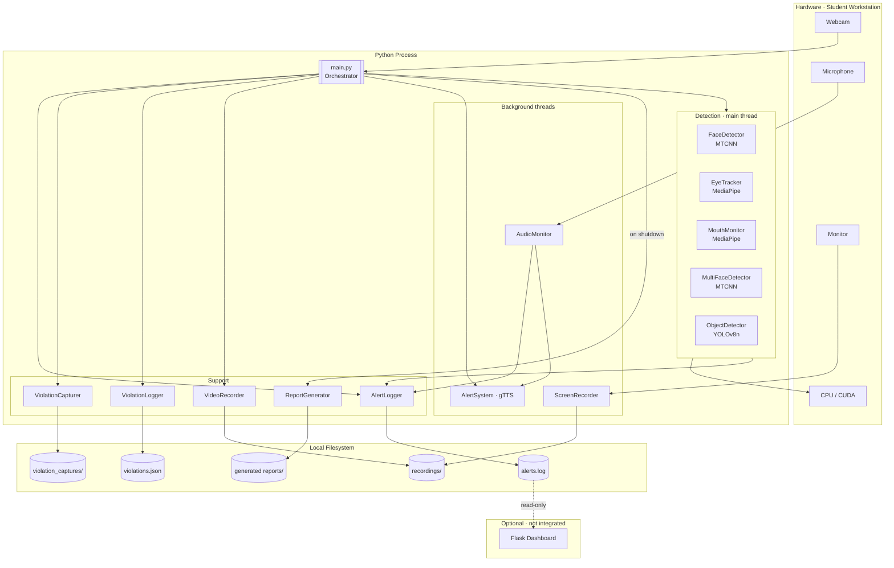
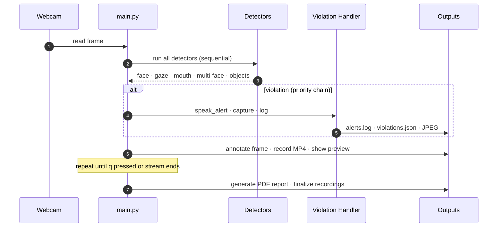
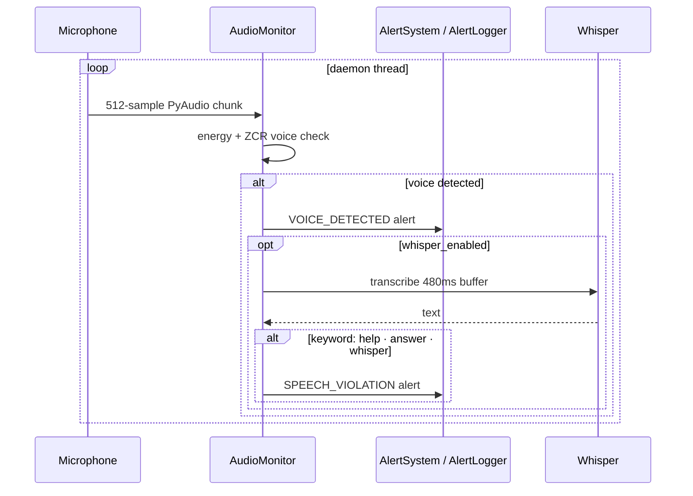
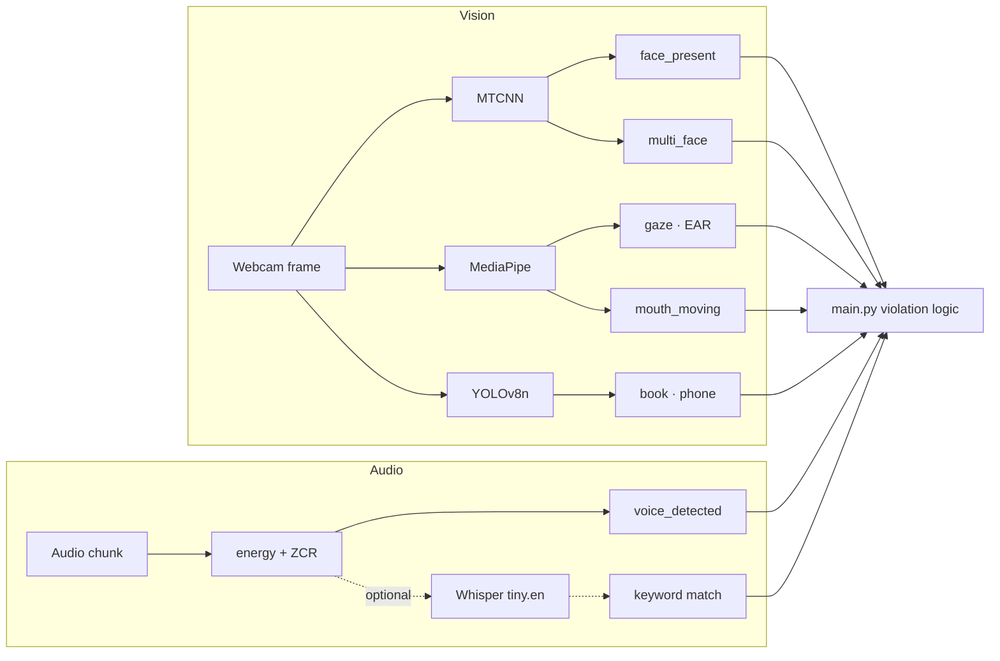
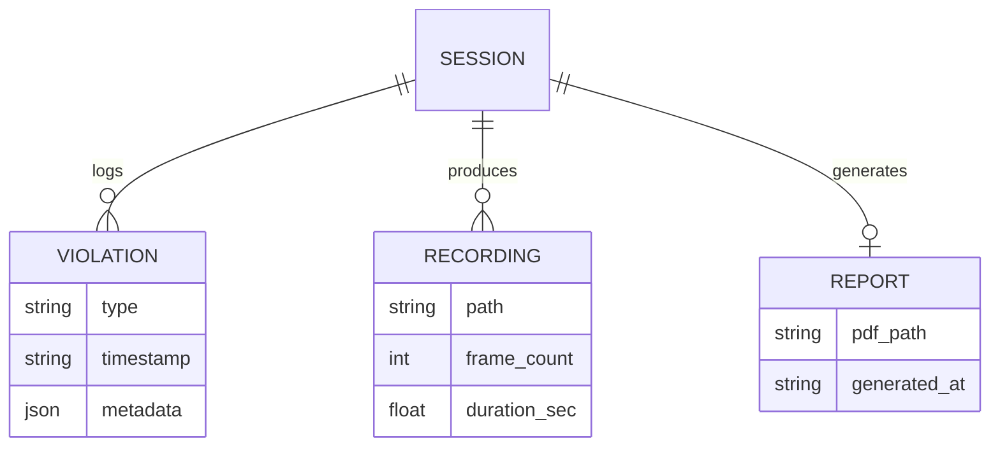

# Architecture Guide

Technical reference for **Sentinel Agent Proctoring** — an open-source exam proctoring and online exam cheating detection system.

← [Back to README](../README.md)

---

## Contents

- [System at a Glance](#system-at-a-glance)
- [Frame Lifecycle](#frame-lifecycle)
- [Component Reference](#component-reference)
- [ML Pipeline](#ml-pipeline)
- [Persistence Model](#persistence-model)
- [Dashboard API](#dashboard-api)
- [Concurrency](#concurrency)
- [Configuration](#configuration)
- [Security & Privacy](#security--privacy)
- [Design Decisions](#design-decisions)
- [Extension Points](#extension-points)
- [Known Issues](#known-issues)

---

## System at a Glance

Sentinel Agent Proctoring is a **monolithic Python desktop application**. A synchronous webcam frame loop drives all vision detectors; audio and screen capture run in background threads. There is no database, message queue, or cloud backend — all state is written to the local filesystem.



**Pipeline stages:** Capture → Detect → React (alert + screenshot + log) → Record → Report (on shutdown).

---

## Frame Lifecycle

The core execution path is a continuous loop — not an HTTP request cycle. One frame iteration:



**Violation priority** (only one type fires per frame):

```
FACE_DISAPPEARED  →  MULTIPLE_FACES  →  OBJECT_DETECTED  →  MOUTH_MOVING
```

`GAZE_AWAY` detection exists in `EyeTracker` but enforcement is commented out in `main.py`.

### Audio path (parallel)



---

## Component Reference

### Orchestrator

| | `src/main.py` |
|---|---|
| **Role** | Entry point — config loading, detector initialization, frame loop, violation response, shutdown reporting |
| **Key behavior** | Synchronous per-frame detection; `if/elif` violation priority; hardcoded `student_info` |
| **Depends on** | All modules under `detection/`, `utils/`, `reporting/` |

### Detectors

Each detector accepts the shared config dict. Most implement `set_alert_logger()` for threshold-based internal logging.

| Module | Model | Returns | Config section |
|---|---|---|---|
| `face_detection.py` | MTCNN | `face_present: bool` | `detection.face` |
| `eye_tracking.py` | MediaPipe Face Mesh | `gaze_direction, eye_ratio` | `detection.eyes` |
| `mouth_detection.py` | MediaPipe Face Mesh | `mouth_moving: bool` | `detection.mouth` |
| `multi_face.py` | MTCNN | `multiple_faces: bool` | `detection.multi_face` |
| `object_detection.py` | YOLOv8n | `objects_detected: bool` | `detection.objects` |
| `audio_detection.py` | Energy/ZCR + Whisper | alerts via side effects | `detection.audio_monitoring` |

**Notable implementation details:**

- `FaceDetector` and `MultiFaceDetector` each load a separate MTCNN instance (no model sharing).
- `ObjectDetector` resizes frames to 320px width, rate-limits via `max_fps`, targets COCO classes 73 (book) and 67 (cell phone). Weights at `models/yolov8n.pt`.
- `EyeTracker` uses a hardcoded 15px gaze threshold — `gaze_sensitivity` in config is not wired. *Inferred gap.*
- `MouthMonitor` uses fixed lip/mouth thresholds, not config values.

### Support utilities

| Module | Output |
|---|---|
| `VideoRecorder` | `recordings/webcam_*.mp4` |
| `ScreenRecorder` | `recordings/screen_*.mp4` (MSS, background thread) |
| `AlertLogger` | `logs/alerts.log` (append-only, per-type cooldown) |
| `AlertSystem` | Vietnamese gTTS voice alerts via pygame (background thread) |
| `ViolationCapturer` | `reports/violation_captures/*.jpg` |
| `ViolationLogger` | `reports/violations.json` |
| `ReportGenerator` | `reports/generated/report_*.pdf` (Jinja2 → wkhtmltopdf) |

### Dashboard *(incomplete)*

| | `src/dashboard/app.py` |
|---|---|
| **Role** | Read-only Flask stub — not connected to the proctoring loop |
| **Status** | `dashboard.html` template missing; `/api/stats` returns mock data |

---

## ML Pipeline

Classical CV and deep learning models — no LLM agents, RAG, or tool orchestration.



### Signal → violation mapping

| Detector signal | Internal alert | Session violation | Enforced |
|---|---|---|---|
| Face absent | `FACE_DISAPPEARED` | `FACE_DISAPPEARED` | Yes |
| Multiple faces | `MULTIPLE_FACES` | `MULTIPLE_FACES` | Yes |
| Book / phone | `FORBIDDEN_OBJECT` | `OBJECT_DETECTED` | Yes |
| Mouth movement | `MOUTH_MOVEMENT` | `MOUTH_MOVING` | Yes |
| Gaze away | `EYE_MOVEMENT` | `GAZE_AWAY` | No |
| Voice | `VOICE_DETECTED` | — | Audio thread |
| Speech keywords | `SPEECH_VIOLATION` | — | If Whisper enabled |

### State management

- Each detector holds its own counters and last-known values.
- No shared event bus — `main.py` polls return values every frame.
- Alert cooldowns are independent across `AlertLogger`, `AlertSystem`, and individual detectors.

---

## Persistence Model

No database. All artifacts are plain files on disk.



| Artifact | Path | Writer | Notes |
|---|---|---|---|
| Violations | `reports/violations.json` | `ViolationLogger` | Flushed on every log call |
| Alert log | `logs/alerts.log` | `AlertLogger` | Append-only, cross-session |
| Screenshots | `reports/violation_captures/` | `ViolationCapturer` | JPEG with overlay label |
| Webcam video | `recordings/webcam_*.mp4` | `VideoRecorder` | Annotated frames |
| Screen video | `recordings/screen_*.mp4` | `ScreenRecorder` | If enabled in config |
| PDF report | `reports/generated/` | `ReportGenerator` | Created on session shutdown |

---

## Dashboard API

Flask is the only HTTP surface. It is **not** on the critical proctoring path.

| Route | Method | Behavior |
|---|---|---|
| `/` | GET | Render `dashboard.html` *(missing)* |
| `/api/alerts` | GET | Last 10 lines of `logs/alerts.log` |
| `/api/stats` | GET | Hardcoded mock JSON |

No authentication, validation layer, or service abstraction — handlers read files directly.

---

## Concurrency

No job queues or worker pools. Three background threads complement the main frame loop:

| Thread | Owner | Daemon | Work |
|---|---|---|---|
| Audio | `AudioMonitor` | Yes | Continuous mic monitoring |
| Screen | `ScreenRecorder` | No | MSS capture at configured FPS |
| TTS | `AlertSystem` | Yes | Non-blocking voice playback |

All vision inference runs **synchronously on the main thread**.

---

## Configuration

Single source of truth: [`config/config.yaml`](../config/config.yaml).

| Section | Controls |
|---|---|
| `video` | Webcam index, resolution, FPS, recording directory |
| `screen` | Monitor index, FPS, enable/disable |
| `detection.face` | Frame interval, confidence threshold |
| `detection.eyes` | Gaze duration, blink EAR, sensitivity |
| `detection.mouth` | Consecutive-frame movement threshold |
| `detection.multi_face` | Consecutive-frame alert threshold |
| `detection.objects` | Confidence, interval, max FPS |
| `detection.audio_monitoring` | Sample rate, energy/ZCR, Whisper toggle |
| `logging` | Log directory, alert cooldown |
| `reporting` | Output paths, wkhtmltopdf binary, severity levels |

Environment variables are not used. Deployment is single-machine desktop only — no Docker, Kubernetes, or CI/CD configuration exists in the repository.

---

## Security & Privacy

| Area | Current state |
|---|---|
| Authentication / authorization | Not implemented |
| Secrets | None in use |
| Data at rest | Plaintext files (video, audio captures, JSON, PDF) |
| Network | Core proctoring is offline-capable; gTTS requires internet |
| Flask exposure | Runs with `debug=True` by default |
| Biometric data | Face video, gaze, and audio captured without encryption |

**Before production use:** add consent flows, encrypt stored artifacts, bind the dashboard to localhost with auth, and define retention/deletion policies. None of these are implemented today.

---

## Design Decisions

| Decision | Rationale | Trade-off |
|---|---|---|
| Monolithic desktop app | Low latency, no streaming infra, works offline | Cannot centrally monitor many students without rework |
| Sync frame loop | Simple, debuggable, no frame races | YOLO inference caps overall FPS |
| File-based persistence | Zero infra deps, easy inspection | No querying or multi-session analytics |
| Independent detector instances | Fully decoupled modules | Duplicate model loading, higher memory |
| gTTS voice alerts | Natural Vietnamese speech without bundling models | Requires network; first-alert latency |
| Violation priority chain | Prevents alert spam per frame | Lower-priority signals suppressed |
| wkhtmltopdf reports | Rich HTML layouts with embedded charts | External binary dependency per OS |

---

## Extension Points

Recommended seams for contributors:

**1. New detector**

```
src/detection/my_detector.py   →   register in main.py   →   add violation handler   →   update severity_levels in config.yaml
```

Pattern:

```python
class MyDetector:
    def __init__(self, config): ...
    def set_alert_logger(self, logger): ...
    def detect(self, frame) -> bool: ...
```

**2. Config-driven thresholds** — read from `config/config.yaml` in `__init__`, document keys with inline comments.

**3. Report templates** — edit `src/reporting/templates/base_report.html`.

**4. Dashboard** — add `src/dashboard/templates/dashboard.html`; wire `/api/stats` to `reports/violations.json`.

**5. Student metadata** — replace the hardcoded dict in `main.py` with CLI args or a config block.

---

## Known Issues

| Issue | Location | Detail |
|---|---|---|
| Audio enable check | `main.py:84` | `if config['detection']['audio_monitoring']:` treats a dict as truthy — audio always starts regardless of `enabled: false`. Likely intended: `['enabled']`. |
| Gaze enforcement | `main.py` | `GAZE_AWAY` handler is commented out |
| Dashboard template | `dashboard/app.py` | References missing `dashboard.html` |
| Mock stats | `dashboard/app.py` | `/api/stats` returns hardcoded values |
| Gaze sensitivity | `eye_tracking.py` | 15px threshold hardcoded; config key unused |
| Empty license | `LICENSE` | No open-source license assigned |

---

*Version 1.0.0 — initial release with core detection, recording, and reporting.*
